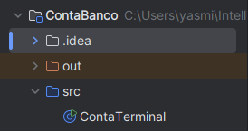

# Conta Banco

## Desafio
Este projeto foi desenvolvido como parte de um desafio de sintaxe em Java. O objetivo era criar um programa que simulasse a criação de uma conta bancária através da entrada de dados pelo terminal.

## Tecnologias Utilizadas
- **Linguagem:** Java
- **Ferramenta de Entrada:** Scanner
- **IDE:** Qualquer IDE compatível com Java (Eclipse, IntelliJ, VS Code, etc.)

## Estrutura do Projeto
O projeto conta com a seguinte estrutura:



## Funcionalidades
O programa permite que o usuário informe os seguintes dados:
- Nome do Cliente
- Agência
- Número da Conta
- Saldo Atual

Com base nas informações fornecidas, o sistema exibe a seguinte mensagem formatada:

"Olá [nomeCliente], obrigado por criar uma conta em nosso banco, sua agência é [agencia], conta [numero] e seu saldo [saldo] já está disponível para saque"


## Como Executar
1. Clone este repositório:
   ```
   git clone https://github.com/ynohra/ContaBanco.git

2. Acesse a pasta do projeto:
    ```
   cd ContaBanco

3. Compile o código:
    ```
    javac src/ContaTerminal.java

4. Execute o programa:
    ```
    java src.ContaTerminal
    ```

## Contribuição
Caso queira contribuir para melhorias neste projeto, fique à vontade para abrir um pull request ou reportar issues!

## Autor
Nome: Yasmin Nohra

GitHub: https://github.com/ynohra
